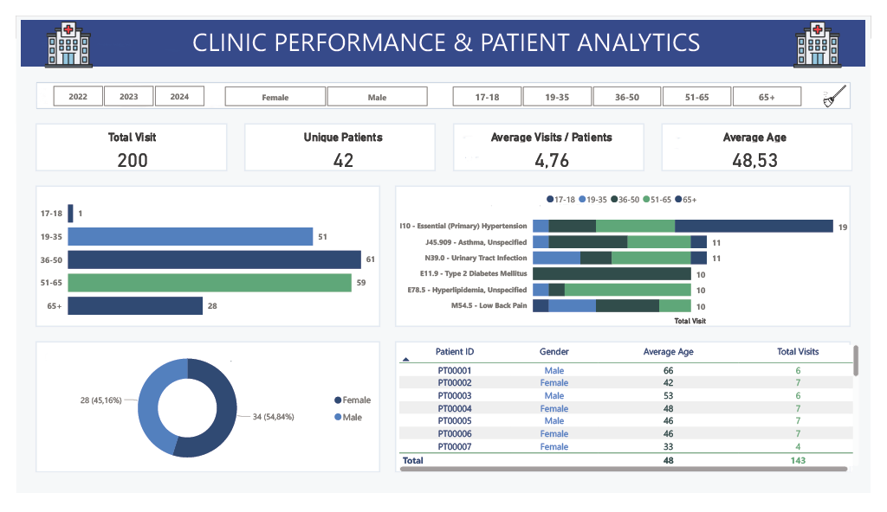

# Clinical Operations & Patient Health Analytics Dashboard

An enterprise-level healthcare business intelligence solution developed in Power BI. This repository showcases end-to-end data pipelines, advanced relational data modeling, and data visualization strategies applied to clinical operations, patient demographics, and ICD-10 diagnostic trends.

## 💻 Dashboard Interface


---

## 🛠️ Tech Stack & Technical Competencies

*   **BI Tool:** Power BI Desktop
*   **ETL & Data Pipeline:** Power Query (Data cleaning, schema mapping, data type enforcement)
*   **Data Modeling:** Star Schema (Fact and Dimension topology)
*   **Analytical Calculations:** DAX (Dynamic measures, KPI construction, time-intelligence analysis)
*   **UX/UI Standards:** Visual hierarchy mapping, cohesive clinical palette, strict specific-column conditional alignment.

---

## 📐 Data Architecture & Modeling (Star Schema)

The dashboard architecture leverages an optimized relational model to maximize query performance and guarantee analytical integrity:
*   **Fact Table:** `patient_visits` — Stores transactional patient interactions, operational timestamps, and clinical diagnosis keys.
*   **Dimension Tables:** 
    *   `age.group` — Demographics, socio-economic attributes, and precise age groups.
    *   `Disease_Details` — Standardized medical terminology mapped directly via ICD-10 codes.
    *   `visit_date` — Time-intelligence table supporting multi-year dynamic filtering (2022–2024).

---
## 🧠 DAX Formulations & Data Dictionary

To ensure dynamic calculations across cross-filtered visuals and standardized data categorization, the repository utilizes specific DAX Measures and Calculated Columns.

### 1. Analytical Measures (KPIs)
These metrics dynamically recalculate based on active dashboard slicers and filters:

* **Total Visits:** Counts the total volume of clinical patient encounters in the dataset.
    ```dax
    Total_visit = COUNT(patient_visits[visit_id])
    ```
* **Unique Patients:** Evaluates the exact count of individual patients by eliminating duplicate historical visits.
    ```dax
    unique_patients = DISTINCTCOUNT(patient_visits[patient_id])
    ```
* **Average Visits Per Patient:** Measures patient retention and operational utilization, safely handling zero denominators.
    ```dax
    avarage_visits_per_patient = DIVIDE([Total_visit], [unique_patients], 0)
    ```
* **Average Age:** Computes the mean age across all recorded clinical visits.
    ```dax
    avarage_age = AVERAGE(patient_visits[patient_age])
    ```

### 2. Calculated Columns (Data Segmentation)
These structural columns are evaluated row-by-row during data refresh to facilitate demographic and clinical grouping:

* **Age Demographic Groups:** Categorizes patient life stages based on their precise calculated age for deeper cohort analysis.
    ```dax
    age_group = 
    SWITCH (
        TRUE (),
        patient_visits[Calculated_Age] <= 18, "17-18",
        patient_visits[Calculated_Age] <= 35, "19-35",
        patient_visits[Calculated_Age] <= 50, "36-50",
        patient_visits[Calculated_Age] <= 65, "51-65",
        "65+"
    )
    ```
* **ICD-10 Disease Custom Mapping:** Maps industry-standard medical ICD-10 keys into descriptive, human-readable clinical diagnoses to maximize dashboard reporting clarity.
    ```dax
    Disease_Details = 
    SWITCH (
        TRUE (),
        patient_visits[icd_code] = "I10", "I10 - Essential (Primary) Hypertension",
        patient_visits[icd_code] = "J45.909", "J45.909 - Asthma, Unspecified",
        patient_visits[icd_code] = "N39.0", "N39.0 - Urinary Tract Infection",
        patient_visits[icd_code] = "E11.9", "E11.9 - Type 2 Diabetes Mellitus",
        patient_visits[icd_code] = "E78.5", "E78.5 - Hyperlipidemia, Unspecified",
        patient_visits[icd_code] = "M54.5", "M54.5 - Low Back Pain",
        patient_visits[icd_code] = "J06.9", "J06.9 - Acute Upper Respiratory Infection",
        patient_visits[icd_code] = "K21.9", "K21.9 - Gastro-esophageal Reflux Disease (GERD)",
        patient_visits[icd_code] = "G43.909", "G43.909 - Migraine, Unspecified",
        patient_visits[icd_code] = "F41.1", "F41.1 - Generalized Anxiety Disorder",
        patient_visits[icd_code] = "F32.9", "F32.9 - Major Depressive Disorder, Unspecified",
        patient_visits[icd_code] = "I25.10", "I25.10 - Atherosclerotic Heart Disease of Native Coronary Artery",
        patient_visits[icd_code]
    )
    ```
