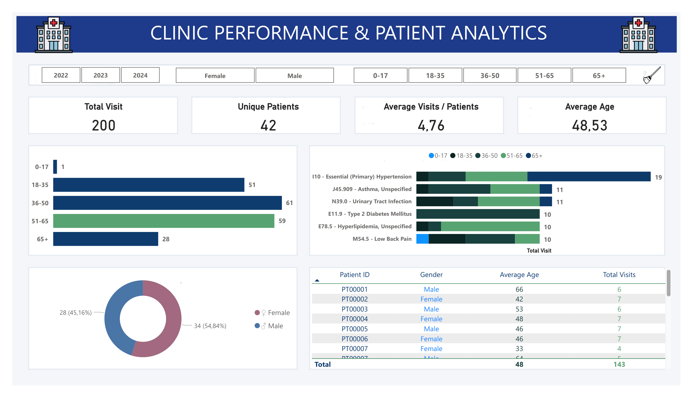

# Clinical Operations & Patient Health Analytics Dashboard

An enterprise-level healthcare business intelligence solution developed in Power BI. This repository showcases end-to-end data pipelines, advanced relational data modeling, and data visualization strategies applied to clinical operations, patient demographics, and ICD-10 diagnostic trends.

## 💻 Dashboard Interface

---

## 🛠️ Tech Stack & Technical Competencies

*   **BI Tool:** Power BI Desktop
*   **ETL & Data Pipeline:** Power Query (Data cleaning, schema mapping, data type enforcement)
*   **Data Modeling:** Star Schema (Fact and Dimension topology)
*   **Analytical Calculations:** DAX (Dynamic measures, KPI construction, time-intelligence analysis)
*   **UX/UI Standards:** Visual hierarchy mapping, cohesive clinical palette, strict specific-column conditional alignment.

---

## 📐 Data Architecture & Modeling (Star Schema)

The dashboard architecture leverages an optimized relational model to maximize query performance and guarantee analytical integrity:
*   **Fact Table:** `patient_visits` — Stores transactional patient interactions, operational timestamps, and clinical diagnosis keys.
*   **Dimension Tables:** 
    *   `age.group` — Demographics, socio-economic attributes, and precise age groups.
    *   `Disease_Details` — Standardized medical terminology mapped directly via ICD-10 codes.
    *   `visit_date` — Time-intelligence table supporting multi-year dynamic filtering (2022–2024).

---
